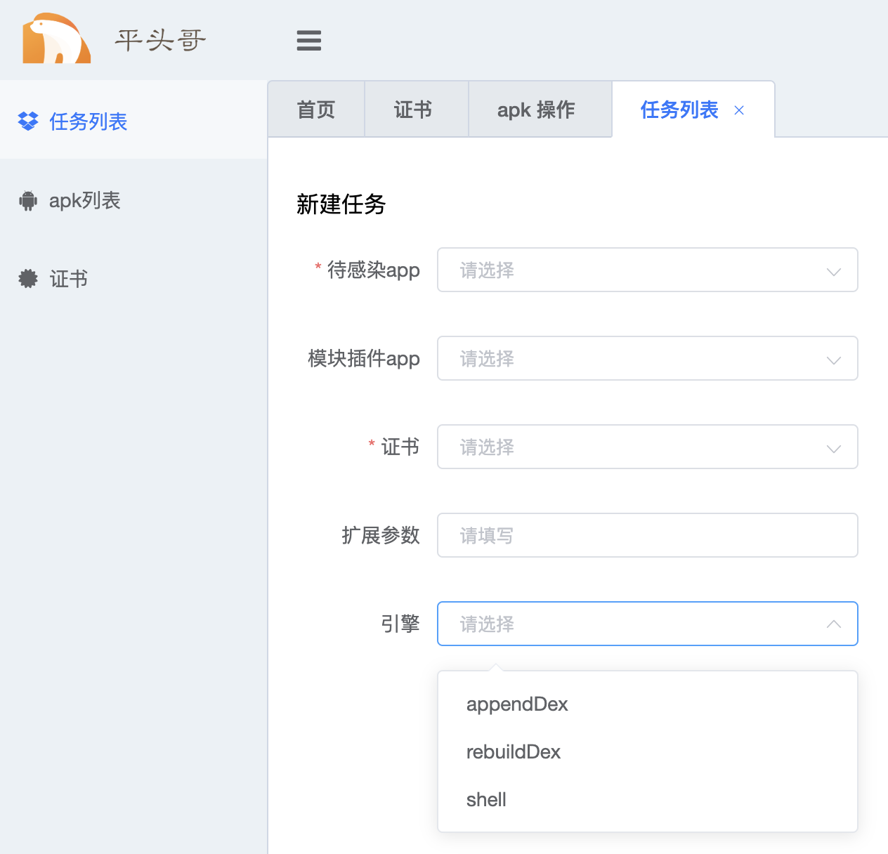

# 开发文档

## API 坐标

ratel api坐标如下
```
dependencies {
 compileOnly 'com.virjar:ratel-api:1.1.0'
}
```
请注意，ratel api发布在maven仓库，而非jcenter仓库
## 总览

ratelAPI是ratel给开发者提供的git编程接口，类似太极一样，ratel也是基本兼容xposed的。正常情况下,引入ratel的api``com.virjar:ratel-api``即可。

除开基本xposed功能支持外，ratelAPI支持如下特性：


## externalAPI

标准的xposedAPI中，会依赖common-lang3，但是在实际导出的API中，common-lang3是被隐藏的。但是实际业务代码实践发现，我们还是需要一个基础的工具库的。
所以我把common-lang3的依赖export到xposed api中了。另外，除开common-lang3，我还引入了common-io。
参考xposed使用common-lang3的做法，由于这毕竟是第三方库，而非jdk本身class。在最终用户也使用了common-lang3的时候，及其容易出现duplicate-class,所以xposed将
common-lang3 rename到external下。

代码结构如下：


可以看到api中，有``common-lang3``和``common-io``的身影。API对应规则则是，在原package前面增加external前缀。

如：``org.apache.commons.lang3.StringUtils``可以用``external.org.apache.commons.lang3.StringUtils``替代

## rposed

常规xposed检测方案中，可以存在xposed堆栈检测，其实在ratel中，只要没有在callOrigin中有堆栈检测逻辑，xposed也是安全的。
为了保证任何时候都可以pass xposed堆栈检测，ratel单独抽取了rposedAPI。

相对于xposed来说，大部分hook相关工具类都迁移到rposed中，rposed和xposed的对应则是将Xposed 各种className头部的``X``替换为``R``，
如：
1. XposedBridge->RposedBridge
2. XposedHelper->RposedHelper
3. XC_MethodHook->RC_MethodHook
4. 甚至xposed入口配置类``de.robv.android.xposed.IXposedHookLoadPackage``->``com.virjar.ratel.api.rposed.IRposedHookLoadPackage``

对于ratel来说，如果你使用ratel作为基本框架开发，建议使用rposed替代xposed。如果是为了兼容xposed模块，或者直接使用（迁移）正常的xposed模块，
那么xposedAPI是需要支持的。

虽然有点羞耻，但是现在的情况是，一般情况下xposed模块可以运行在ratel框架上，但是ratel模块很难运行在xposed上。

ratelAPI从1.1.0之后支持RPosed

## RatelToolKit

ratelToolKit是ratel提供的API的入口，他的全称限定名称为：``com.virjar.ratel.api.RatelToolKit``。RatelToolKit的各种成员变量在API引用中都是null，
实际上在runtime里面会被ratel framework初始化，所以可以大胆的访问RatelToolKit里面的成员对象。成员解释如下：

### RatelToolKit.sContext
全局的一个context，context是调用Android系统功能的重要对象。有这个对象之后，无需手动通过拦截attach的方式获取context,其实在ActivityThread里面随时可以捞取Context，自己捞也可以。
RatelFramework在运行过程中，已经进行了context的构造。另外考虑很多Xposed插件通过attachContext的方式作为模块逻辑起点，这个在某些xposedLike framework中可能存在一些不兼容问题。在ratel中则无须考虑这个问题，我们单独为这个功能做了兼容。

### RatelToolKit.ratelConfig
ratel框架的配置信息，代表了ratel编码、打包、运行过程产生的一些特定flag,这些flag会影响ratel framework的生命周期，一般情况下用户不需要关心这个接口，排除未来某些特定的framework hack场景。

### RatelToolKit.ioRelocator
这是一个读写重定向的接口，通过他可以改变整个经常的读写访问逻辑，主要用在设备指纹对抗方面，一般情况下，用户不必关心这个功能，除非你在ratel上面有非常深度的功能定制。需要注意的是，ioRelocator只能在ratelFramework启动完成之前调用，也就是``de.robv.android.xposed.IXposedHookLoadPackage#handleLoadPackage``之中，这涉及到ratel framework生命周期问题，详见"ratel framework lifecycle" TODO

### RatelToolKit.processName
当前进程名称

### RatelToolKit.packageName
当成packageName

### RatelToolKit.ratelVersionName
ratel engine版本号
### RatelToolKit.ratelVersionCode
ratel engine版本号，数字格式
### RatelToolKit.whiteSdcardDirPath
存储卡白名单地址，这个功能在虚拟化环境中使用，虚拟化环境下，sdcard将会被隔离，导致无法往sdcard写入数据。但是如果ratel模块期望通过sdcard和其他app交换数据，那么需要通过一个sdcard白名单进行放行。该路径规则为：  ``/sdcard/ratel_white_dir/packageName/``

### RatelToolKit.virtualEnv

这是ratel系统的虚拟化环境功能支持，在这个模块中，设备指纹和文件读写都会被隔离，如此实现一键新机或者一机多号。我们还提供API接口和虚拟化环境进行通信，以便对虚拟化环境做更深度的定制。

#### VirtualEnvModel
VirtualEnvModel代表ratel框架支持的集中虚拟化设备模式``com.virjar.ratel.api.VirtualEnv.VirtualEnvModel``，分别为：
1. DISABLE：未启用虚拟环境
2. START_UP：每次启动app切换设备数据
3. INSTALL：app重新安装的时候切换设备数据，适合登录态+不会编程控制
4. MULTI：多用户模式，这个模式比较特殊，将会放大用户。通过时间分割的方式实现多用户
5. MANUAL：通过ratel api来控制设备信息切换，灵活的根据业务逻辑控制。比如发现设备被拉黑，主动控制设备切换

一机多号功能基于MULTI实现，如果希望app每次打开都是新设备，那么可以制定模式为：START_UP

#### com.virjar.ratel.api.VirtualEnv#getVirtualEnvModel
查询当前设备虚拟环境，结果为枚举。包含系统ratel定义的几种模式

#### com.virjar.ratel.api.VirtualEnv#switchEnv
这个接口非常重要，通过这个接口实现设备切换，当然这个接口调用的前提是当前虚拟化模式为``MULTI``，switchEnv需要传入一个字符串作为参数，该参数代表设备id，如果userId不存在，那么重新创建。如果userId为控，那么ratel自动创建一个。userId需要满足JavaIdentify规则（数字、字母、下划线），不满足规则的字符将会被抹除。另外注意，本API只有在main进程中执行有效，所有环境操作只能由主进程执行，如果设备数据切换成功，那么将会导致app主动停止。需要被其他框架重新守护打开。
如下代码，通过sdcard的一个文件控制当前设备
```
    private static void switchUserBySdcardFile() {
        String nowUser = RatelToolKit.virtualEnv.nowUser();

        File file = new File(new File(RatelToolKit.whiteSdcardDirPath), "userId.txt");
        if (file.exists()) {
            try {
                String userIdFromSdcard = FileUtils.readFileToString(file, StandardCharsets.UTF_8);
                if (!StringUtils.equals(nowUser, userIdFromSdcard)) {
                    RatelToolKit.virtualEnv.switchEnv(userIdFromSdcard);
                }
            } catch (IOException e) {
                Log.i(tag, "failed to read id ctr file", e);
            }
        } else {
            Log.i(tag, "multi user id control file not exist: " + file);
        }
    }
```
如下代码，硬编码切换设备
```
private static void switchTo18782164555() {
        RatelToolKit.virtualEnv.switchEnv("18782164555");
    }
```

#### com.virjar.ratel.api.VirtualEnv#nowUser
 当前用户生效的用户，仅在MULTI模式下有效在，当前生效用户代表虚拟化设备ID

#### com.virjar.ratel.api.VirtualEnv#removeUser
删除某个用户。用户需要存在，并且不能删除nowUser

#### com.virjar.ratel.api.VirtualEnv#availableUserSet
系统可用的user集合，仅在multi模式下有效

#### com.virjar.ratel.api.VirtualEnv#keepEnvForManualModel
manual 模式下，需要手动控制是否切换设备，如果设置设备切换状态为true。那么设备信息永远不会切换。除非将标记从新设置为false。 keep标记默认为false

#### com.virjar.ratel.api.VirtualEnv#rawFingerData
获取原始的可以作为唯一设备的指纹数据，虚拟化之后，我们拿到的imei之类的数据会变成假的。这是获取真实数据的一个后门。

### FingerPrintModel
设备指纹填充接口，通过这个即可灌入模拟的设备数据，这个API接口使用蛮简单，就不多解释了。
不过需要注意的是，自ratelAPI 1.2.0之后才支持这个功能

## ratel 全局配置

在ratel构建过程中，可以填入一些内置参数，用于控制app的全局特性，如控制虚拟设备开启。这些参数是一些键值对如：
``virtualEnvModel=START_UP for_ratel_apps=com.virjar.ratel.demoapp``
参数设定有两个入口，分别为xposed模块manifest和构建附加参数

### 模块manifest增加全局配置
熟悉xposed模块开发的同学，一定知道如何标记一个apk为模块apk
```
<meta-data
    android:name="xposedmodule"
    android:value="true" />
<meta-data
    android:name="xposeddescription"
    android:value="test hook demo app" />
<meta-data
    android:name="for_ratel_apps"
    android:value="com.virjar.ratel.demoapp" />
<meta-data
    android:name="virtualEnvModel"
    android:value="Multi" />
```
能看到，上述配置中，前面两个是标准的xposed配置项, 后面两个则是ratel特有的配置了，在AndroidManiest.xml的Application节点下，配置``meta-data``，参数将会作为key-value-pair打入到ratel全局空间。

### 通过构建参数增加全局配置
你也可以在构建apk的时候，就设定一些参数，如果你的业务上，模块是外置的，可能你会倾向于在构建的时候附加参数。在网站增加构建任务的时候，可以填写扩展参数:


扩展参数的格式样例为:``ratel_properties_virtualEnvModel=START_UP``，也就是在对应的key前面增加前缀``ratel_properties_``,如果有多个参数，那么空格分割即可，存在空格需要引号包裹。

### 目前支持扩展参数配置

#### virtualEnvModel
控制设备虚拟方式，默认为不开启，有四种可选:
1. DISABLE：未启用虚拟环境
2. START_UP：每次启动app切换设备数据
3. INSTALL：app重新安装的时候切换设备数据，适合登录态+不会编程控制
4. MULTI：多用户模式，这个模式比较特殊，将会放大用户。通过时间分割的方式实现多用户
5. MANUAL：通过ratel api来控制设备信息切换，灵活的根据业务逻辑控制。比如发现设备被拉黑，主动控制设备切换
value值不区分大小写

#### for_ratel_apps
本配置仅对单个模块生效，所以只支持在manifest中配置，由于描述模块正对的app列表，由于ratel不像xposed那样针对于全局生效，ratel主要用于对应用app生效，大部分情况一个模块插件只为特定的app起作用，配置这个之后，模块在加载插件的时候会根据这个配置过滤。

比如某个插件配置了只适用于com.a.b,那么com.a.c则不会加载这个插件。

#### moduleHasNativeCode
本配置仅对单个模块生效，所以只支持在manifest中配置，如果模块插件具有so，那么配置``moduleHasNativeCode=true``,之后插件加载方式将会设定加载插件中的so，无须考虑so适配问题。如果是embed模式打包，那么so会自动copy到外部，也无须考虑so适配问题。

请注意，如果你的模块需要加载so，你又没有配置这个参数，那么你需要hook System.loadLibary或者类似函数修正so地址
