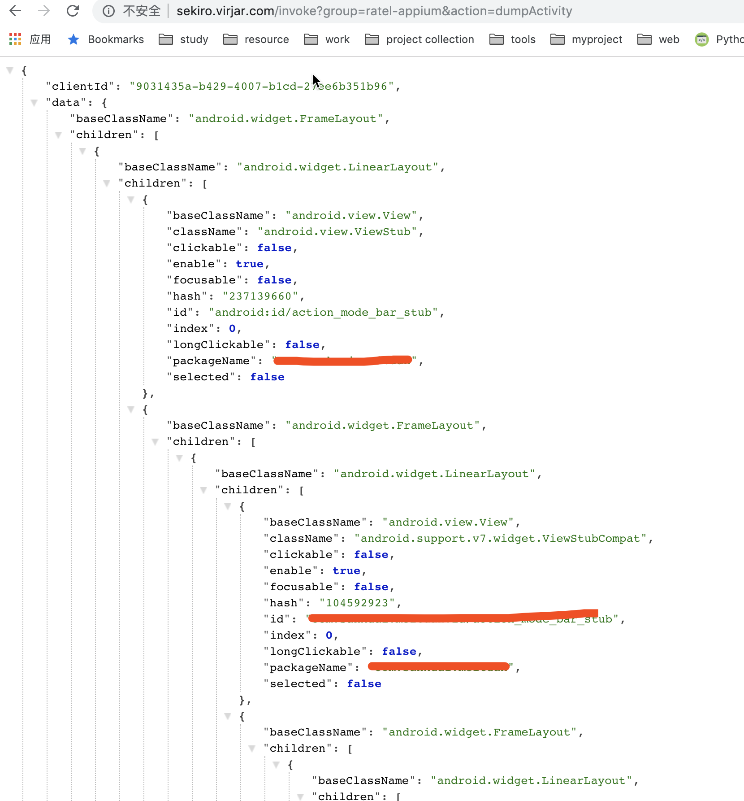

# ratel扩展开发包
ratel扩展开发包是一个工作在ratel框架之上的扩展开发包，对于ratel插件来说，他并不是必须的。ratel扩展包更多面对企业用户做app深度控制时使用。主要功能包括：

1. 流量拦截
2. ssl证书信任
3. UI自动化

扩展开发包的依赖如下：
```
dependencies {
    compileOnly 'com.virjar:ratel-api:1.3.1'
    implementation 'com.virjar:ratel-extersion:1.0.2'
}

```

## 流量拦截

流量拦截是ratel支持的一种基于socket对象监控的抓包方案。他可以直接拦截所有tcp流量，包括SSL。同时不需要考虑SSL证书，http代理无法生效等问题，并且在在抓包的同时，可以通过堆栈回溯方法知道网络流量的代码发送位置。本模块命名为SocketMonitor。

使用socketMonitor的方法很简单。通过注册网络事件监听函数即可:

```
 SocketMonitor.setPacketEventObserver(dataModel -> {
            try {
               //抓包数据在dataModel中，处理你的抓包业务即可
            } catch (Throwable throwable) {
                throwable.printStackTrace();
            }
        });
```
当然，如果你只是想在日志文件里面记录所有的抓包结果,那么使用如下代码：
```
SocketMonitor.setPacketEventObserver(new FileLogEventObserver(context.getDir("socket_monitor", Context.MODE_PRIVATE)));
```
然后在socket_monitor文件夹下即可看到抓包数据


## ssl证书信任
这个没什么好说的，迁移了大名鼎鼎的JustTrustMe，实现SSL中间人攻击抓包证书检查问题。

```
JustTrustMe.trustAllCertificate();
```
## UI自动化
这个模块命名为SuperAppium,Appium是一个大名鼎鼎的UI自动化框架，主要给测试人员提供app测试case的功能。同时也有很多人基于Appium进行数据抓取，跑单等业务。

SuperAppium则是控制功能比Appium更强的一套自动化框架，他是基于ratel本身提供的上帝模式能力儿实现的。主要表现为以下特点：

1. 页面事件回调的异步序列调用。和Appium项目，SuperAppium的case编写，通过Activity生命周期挂钩。页面被加载会直接进入case操作函数。不需要类似Appium通过sleep等待，pull页面状态判断。其控制速度相对快很多
2. 进程内驱动，控制脱机。Appium的控制代码运行在PC之上，中间通过USB传输控制指令到手机中，其控制数据流为:python(PC)->appiumServer(PC)->USB->BootStrap.jar->UIAutoMator->AccessibilitySerivice->App。中间夸了两个主机，六个进程。整个链路太长，其实大规模使用极度不稳定。然后SuperAppium则是通过代码注入的方式控制app，所有指令控制发生在app宿主进程，不存在长链路问题排查
3. 更细粒度的界面元素控制能力，主要体现在两个方面。部分场景下uiautomator界面元素dump失败、界面属性扩展能力(我们独立实现了DOM tree模型和xpath模块，使得界面元素内容可以通过插件扩展，xpath函数可以通过插件扩展功能等)
4. app内部mode直接干预，比如数据抓取的时候，Appium需要解析界面元素才能得到数据，这是一个非常繁琐且适配麻烦的工作。但是在SuperAppium里面可以直接拦截数据返回API，无需在数据渲染在界面的时候操作。
5. Appium对抗，体现在两个方面。A:app可能检测appium的存在，然后存在对抗。B:少数Appium无法完成的工作，比如Appium和adb发送的DOM事件类型，在Android端定义为UNKNOWN，实际人操作对应的事件类型为FINGER。
6. View模型的直接操作，在UI操作结果之后，可以直接获取原生View对象，直接调用对应的方法或者获取数据等

### 使用方法

主要分两步，启动dump服务器和编写页面驱动逻辑(以下代码在插件中书写)

####  Sekirodump服务器

```
   //启动dump服务器
   SekiroStarter.startService("sekiro.virjar.com", Constants.defaultNatServerPort);
```

这么做的目的，是通过Sekiro系统挂载一个在线服务，主要可以实时dump页面布局。类似与UIAtomatorViewer，为我们编写页面驱动提供帮助。上述代码将会使用``sekiro.virjar.com``启动服务，关于Sekiro的系统描述，参见：[Sekiro github](https://github.com/virjar/sekiro)

启动服务器之后，则可以通过浏览器实时dump页面内容:


#### 页面逻辑书写
```
        PageTriggerManager.addHandler("com.xxx.MainActivity",
                new MainActivityPageHandler());

        PageTriggerManager.addHandler("com.xxx.lPoiListFrontActivity",
                new PoiListFrontActivityPageHandler());

        PageTriggerManager.addHandler("com.xxx.SearchActivity",
                new SearchActivityPageHandler());

        PageTriggerManager.addHandler("com.xxx.SearchResultActivity",
                new SearchResultActivityPageHandler());
```

基本上书写模版类似上面描述。我们根据Android的activity划分页面逻辑，每个activity逻辑隔离。不过你可以通过各种方式在不同页面之间交换数据。
其中``PageTriggerManager``是一个非常重要的类，他可以实现对页面跳转逻辑的监控


#### PageHander
一个PageHandler的样式如下:
```
import android.app.Activity;

import com.virjar.ratel.api.extension.superappium.PageTriggerManager;
import com.virjar.ratel.api.extension.superappium.ViewImage;

public class MainActivityPageHandler implements PageTriggerManager.ActivityFocusHandler {
    @Override
    public boolean handleActivity(Activity activity, ViewImage root) {
        if (!root.clickByXpath("//android.view.View[@contentDescription='火车票/机票']")) {
            root.clickByXpath("//android.view.View[@contentDescription='机票火车票']");
        }
        return true;
    }
}
```
上面代码的含义就是，app出现在当前Activity的时候，在界面中寻找``机票火车票``的item，然后点击他。其中回调函数存一个boolean的返回值，如果返回false代表当前界面还不满足界面操作的条件(可能由于网络延迟，对应的界面在当前时间点没有渲染出来)，此时框架会在后续重试，重试次数默认为10次。

#### SuperAppium的DOM模型
由刚才的demo可以看到我们操作界面元素的时候出现了一个``ViewImage``，这个即是SuperAppium在Android原生dom上面构建的一层关于DOM tree的抽象模型，他反应的是一个树形结构，包括当前节点的属性、当前节点名称、当前节点的子节点等常规tree mode的概念。同时也有sbling,parent,attribute等系列dom操作相关函数。

ViewImage本身提供树形结构抽象，但是不提供attribute定义。所以在ViewImage底层，存在一个XMode模块，它实现了每个View类型有哪些属性的功能抽象。比如``android.widget.TextView``将会有``text``属性，使用者可以自行扩展,对应的中控函数见:``com.virjar.ratel.api.extension.superappium.xmodel.ValueGetters``
